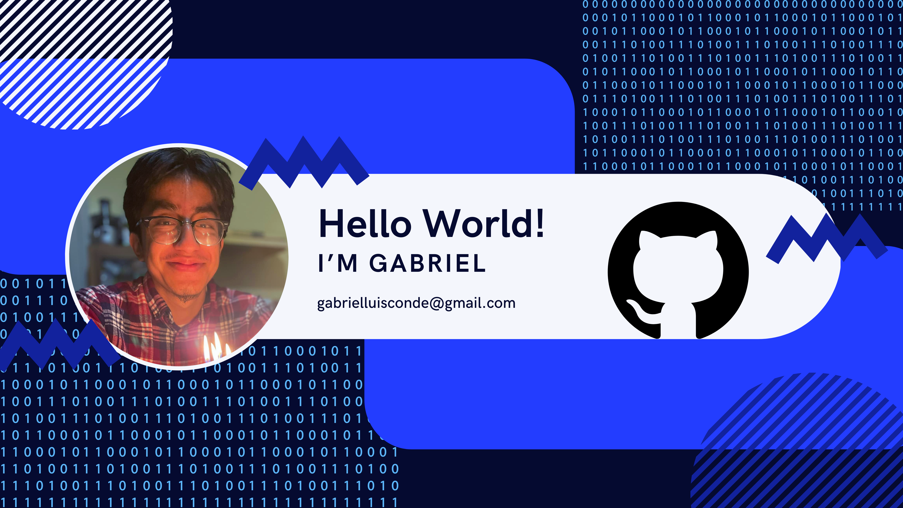

# I'm Gabriel, a dedicated learner on a mission to master the world of computer programming and full-stack web development. 🌐💻 

## 📚 Education & Background

- 🎓 Currently, I'm attending Santa Monica College, where I'm studying computer programming and honing my skills in software development.

- 💡 My journey into coding began when I participated in Urban TXT's Teens Exploring Technology program. Urban TXT focuses on youth development, teaching students to meet the challenges of adolescence and adulthood to achieve their full potentials.

- 🌱 Inspired by my experience with Urban TXT, I developed a keen interest in coding and its potential to create positive change. I was particularly drawn to full-stack development, which involves working with all the technologies required to develop an idea into a finished product. Urban TXT's emphasis on teaching coding languages empowered me to make an informed decision about pursuing computer science as a major.

## 💻 Why Web Development?

- 🚀 I'm passionate about technology and the limitless possibilities it offers for innovation and creativity.
- 💡 Web development, in particular, captivates me because of its dynamic nature, rapid evolution, and its potential to impact people's lives globally.
- 🌟 I believe that mastering web development will empower me to bring my ideas to life, build meaningful projects, and contribute to solving real-world problems.

## 🛠️ Self-Teaching Resources

I'm an avid self-learner, constantly exploring various resources to enhance my knowledge and skills in web development. Here are some of the resources I frequently use:

- **FreeCodeCamp**: I'm actively engaged in FreeCodeCamp's curriculum, which offers a comprehensive and interactive approach to learning web development, including HTML, CSS, JavaScript, and more.

- **Dr. Angela Yu's Full Stack Web Development Course**: I'm currently enrolled in Dr. Angela Yu's highly acclaimed course on Udemy, where I'm learning the ins and outs of full-stack web development using modern technologies like HTML, CSS, JavaScript, React.js, Node.js, and MongoDB.

- **Boot.dev**: Boot.dev is a unique platform that I utilize for focused backend development learning. This platform stands out in the online learning space for its laser focus on teaching backend development, which is somewhat rare. Moreover, Boot.dev addresses the challenge of boredom in online learning, making the learning experience engaging and effective.

In addition to these resources, I also explore other platforms, books, and documentation to further expand my expertise in web development.

## 📫 Let's Connect

If you share similar interests in computer programming and web development, or if you have any suggestions for resources or projects, I'd love to connect with you! Feel free to reach out via email at [gabrielluisconde@gmail.com](mailto:gabrielluisconde@gmail.com) or connect with me on [LinkedIn](https://www.linkedin.com/in/gabriel-conde). Let's learn and grow together!
