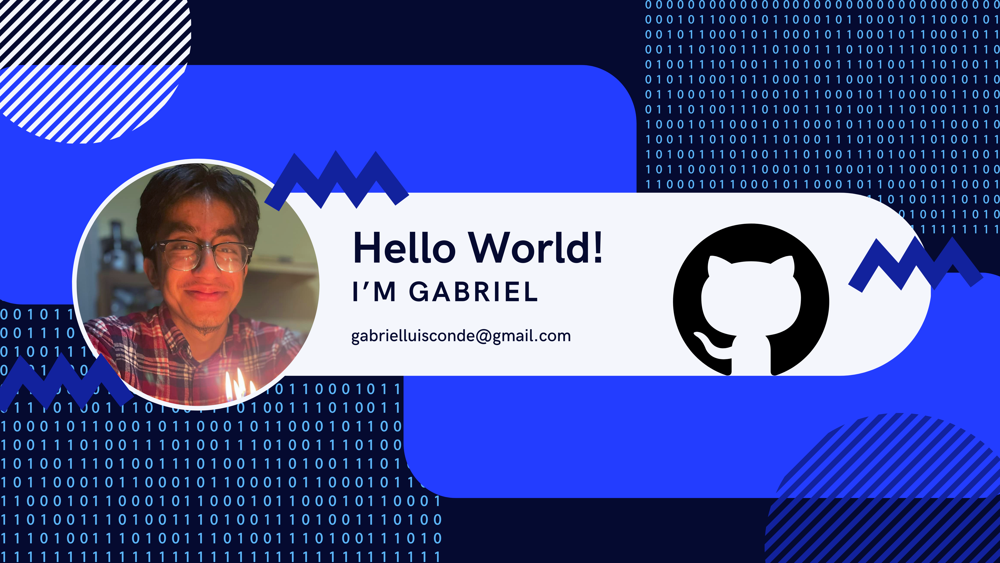

# I’m currently focused on back-end development 🌐💻 

- 💡 My journey into programming began when I participated in Urban TXT's Teens Exploring Technology program. Urban TXT focuses on youth development through programming, teaching students to meet the challenges of adolescence and adulthood to achieve their full potentials.

- 🌱 Inspired by my experience with Urban TXT, I developed a keen interest in programming and its potential to create positive change. I was particularly drawn to full-stack development, which involves working with all the technologies required to develop an idea into a finished product. Urban TXT's emphasis on teaching coding languages empowered me to make an informed decision about pursuing a career in backend development.

## 💻 Why Back-end?

Back-end development really speaks to me because it’s where the “magic” happens behind the scenes. Designing scalable and efficient back-end services challenges me to solve real-world problems and think deeply about how apps handle loads and complexity.

While the front-end is what users see, the back-end is the foundation that makes it all possible—and that’s where I want to make my impact. Learning Python, TypeScript, SQL, Docker, and CI/CD has opened my eyes to how powerful well-built back-end systems can be, and I’m excited to keep growing these skills as I work on meaningful projects.

For me, back-end development is not just about coding—it’s about creating reliable, maintainable solutions that people and businesses can depend on every day.

## 🛠️ Self-Teaching Resources

I'm an avid self-learner, constantly exploring various resources to enhance my knowledge and skills in web development. Here are some of the resources I frequently use:

- **Dr. Angela Yu's Full Stack Web Development Course**: I'm currently enrolled in Dr. Angela Yu's highly acclaimed course on Udemy, where I'm learning the ins and outs of full-stack web development using modern technologies like JavaScript, Node.js, and MongoDB.

- **Boot.dev**: Boot.dev is a unique platform that I utilize for focused backend development learning. This platform stands out in the online learning space for its laser focus on teaching backend development, which is somewhat rare. Moreover, Boot.dev addresses the challenge of boredom in online learning, making the learning experience engaging and effective.

In addition to these resources, I also explore other platforms, books, and documentation to further expand my expertise in back-end development.

## 📫 Let's Connect

If you share similar interests in programming, or if you have any suggestions for resources or projects, I'd be more than happy to connect with you! Feel free to reach out via email at [gabrielluisconde@gmail.com](mailto:gabrielluisconde@gmail.com) or connect with me on [LinkedIn](https://www.linkedin.com/in/gabriel-conde).
